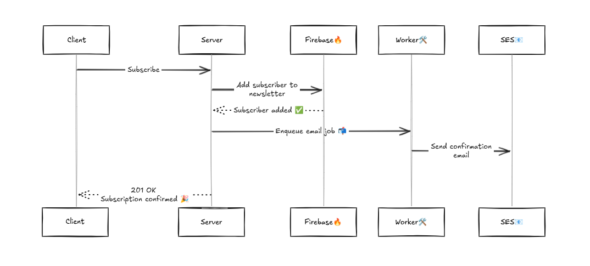

## Project Description

This project implements a **newsletter backend service** that allows registered users  to create and manage newsletters that consumers can subscribe to.

A newsletter is modeled as a publication composed of individual posts. Editors curate newsletters and publish news or messages, which are delivered via e-mail to all subscribed users.

The backend exposes a **RESTful API** designed to serve both **web and mobile clients**. It integrates multiple external services and data stores, each chosen based on responsibility:

- **PostgreSQL** is used to persist registered user accounts and application data.
- **Firebase** is used to manage newsletter subscribers.
- **AWS Simple Email Service (SES)** is used to deliver confirmation content to subscribers via e-mail.

The system follows a Domain-Driven Design (DDD) architecture,
with clearly defined bounded contexts and separation between domain,
application, infrastructure, and transport layers.

## Technology stack

- **Go (Golang)** — backend language
- **PostgreSQL** — user and core data persistence
- **Firebase** — subscriber management
- **AWS SES** — email delivery
- **REST API** — web and mobile client integration

## Environment Variables

The application requires the following environment variables to run correctly.

| Variable | Purpose |
|----------|---------|
| `JWT_SECRET_KEY` | Secret key used to sign JWT tokens for authentication |
| `DSN` | PostgreSQL connection string |
| `GOOGLE_APPLICATION_CREDENTIALS` | Path to Firebase service account JSON file |
| `AWS_ACCESS_KEY_ID` | AWS access key for SES |
| `AWS_SECRET_ACCESS_KEY` | AWS secret key for SES |
| `AWS_REGION` | AWS region for SES |
| `AWS_FROM` | Default "from" email address for sending newsletters |
| `BASE_URL` | Base URL of the API (used in email links) |
| `WORKERS` | Number of background workers for async jobs |
| `BUFFER_SIZE` | Size of the job queue buffer |

#### How to set environment variables
Create a `.env` file with the required variables (see above).

## Testing & Coverage

The project includes tests covering core business logic and application workflows.  

Tests focus on:

- **Application layer** – use cases and services for users, newsletters, and subscriptions  
- **HTTP handlers** – REST API endpoints and request/response validation  

Currently, the overall test coverage is **40.2%** of statements.  

## Getting started

1. Set environment variables in a `.env` file.
2. Install dependencies. 
3. Run the API.

The API should be available at `http://localhost:8001`.

## Endpoints

```markdown
- `POST   /users/signup`                  — Register a new user
- `POST   /users/signin`                  — Authenticate and get JWT token
- `POST   /newsletters`                   — Create a newsletter (requires auth)
- `GET    /newsletters`                   — List newsletters of a user (requires auth)
- `POST   /subscriptions/{newsletter_id}` — Subscribe to a newsletter
- `DELETE /subscriptions/unsubscribe`     — Unsubscribe to a newsletter (uses a token) 
```

## Future improvements

- Add more unit tests to increase coverage and reliability.
- Add Swagger for API documentation.
- Add rate limiting, particularly for login, to prevent brute-force attacks.
- Add retry and backoff mechanisms to worker pool for better resilience.
- Add a message broker to make background tasks persistent.

## Project Structure

```
.
├── cmd/
│   └── api/                        # Application entrypoint (API)
│
├── config/                         # Configuration and environment setup
│
├── internal/
│   ├── infrastructure/
│   │   ├── aws/                    # AWS-related integrations
│   │   ├── database/               # Shared database utilities
│   │   ├── firebase/               # Firebase integration
│   │   └── workerpool/
│   │       └── jobs/               # Background job definitions
|   |       └── (pool) 
│   │
│   ├── newsletters/
│   │   ├── application/            # Newsletter use cases and services
│   │   ├── domain/                 # Newsletter domain models and rules
│   │   └── infrastructure/
│   │       └── postgres/           # PostgreSQL implementation
│   │
│   ├── notifications/
│   │   ├── application/            # Notification use cases
│   │   └── domain/                 # Notification domain models
│   │
│   ├── subscriptions/
│   │   ├── application/            # Subscription use cases
│   │   ├── domain/                 # Subscription domain models
│   │   └── infrastructure/
│   │       └── firebase/           # Firebase implementation
│   │
│   └── users/
│       ├── application/            # User-related use cases
│       ├── domain/                 # User domain models
│       └── infrastructure/
│           └── postgres/           # PostgreSQL implementation
│
└── transport/
    └── http/
        ├── handler/                # HTTP handlers
        └── (routing & server code)
```

## Subscription flow

The following diagram illustrates the process of creating a subscription.


